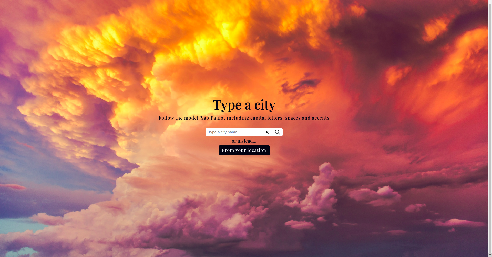
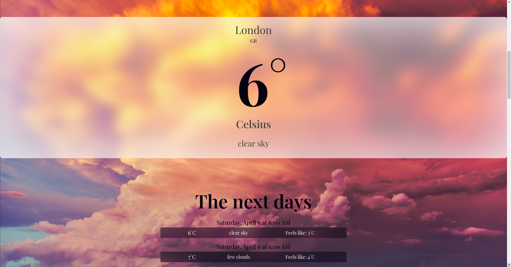
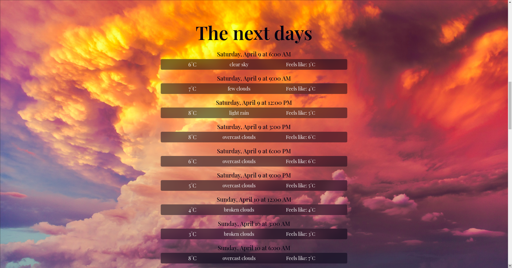

# React-Weather-app
Fullstack React Weather app based on the OpenWeather API.

To run the project locally, from the root directory type `npm start`.
It will start the nodemon server and React app through concurrently.

# Screenshots
__Home page__ minimalistic approach with two options:
- Type a city name;
- Press the geolocation button and let the app do the work for you(in this case it takes the weather from your current location).

__Current weather__
Displays the current day's weather.

__Forecast weather__
Displays the weaher forecast within a 3 hour interval for the next 8 days.

OBS: There are also contextualized ERROR messages to handle Server errors, geolocation errors(liek browser blocking it) and wrong city names.
